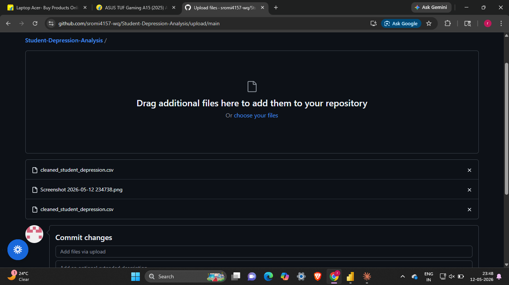

# Student Depression Analysis

## Problem Statement
Academic performance and financial stability are commonly assumed to be 
protective factors against student mental health issues. This analysis 
challenges that assumption by showing suicidal ideation exists across 
all student profiles.

## Dataset
- Source: Kaggle
- Size: 27,883 students
- Features: 18 columns including CGPA, Academic Pressure, Financial Stress, 
  Sleep Duration, Depression, Suicidal Thoughts

## Tools Used
- Python (Pandas, Seaborn, Matplotlib)
- Power BI

## Key Insights
1. 63% of students have experienced suicidal thoughts
2. Academic Pressure is the strongest driver of depression (correlation: 0.47)
3. Financial Stress is second (correlation: 0.36)
4. CGPA has almost zero correlation with depression (0.022)
5. Gender has no significant impact — depression is equal across genders
6. 3,699 students show no depression but still report suicidal thoughts
7. Class 12 students have the highest suicidal thoughts rate at 69%
8. Hyderabad has the highest suicidal thoughts rate among top 5 cities

## Project Structure
- student_depression.py — Python EDA and analysis code
- cleaned_student_depression.csv — Cleaned dataset
- dashboard.pbix — Power BI dashboard

- ## Dashboard Preview

## Key Takeaway
Mental health risk cannot be predicted by financial status or academic 
performance alone. This analysis proves it requires a multi-dimensional 
approach — addressing academic pressure, financial stress, and city-level 
factors simultaneously.
